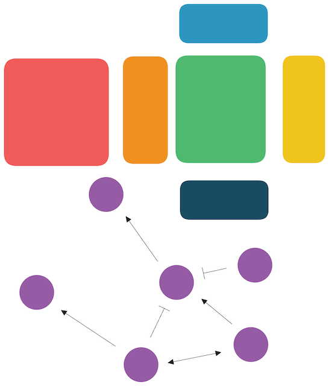

# GRnnData

[](https://codecov.io/gh/cantinilab/GRnnData)
[](https://github.com/cantinilab/GRnnData/actions/workflows/main.yml)
[](https://badge.fury.io/py/benGRN)
[](https://pepy.tech/project/GRnnData)
[](https://pepy.tech/project/GRnnData)
[](https://pepy.tech/project/GRnnData)
[](https://img.shields.io/github/issues/cantinilab/GRnnData)
[](https://github.com/psf/black)
[](https://doi.org/10.1101/2024.07.29.605556)



GRnnData works similarly to anndata. The goal was to use the .varm/.varp of anndata to store the GRN data associated with a dataset and have a formal way to work with GRNs.

GRnnData is a subclass of anndata.AnnData, it enforces only that a .varp exists for the anndata

GRnnData also contains multiple helper functions to work with GRNs in scRNAseq like compute_connectivities, get_centrality, compute_cluster, enrichment, metrics, etc. but also accessing the grn with .grn, .targets, .regulators,...

The package has been designed together with the [scPRINT paper](https://doi.org/10.1101/2024.07.29.605556) and [model](https://github.com/cantinilab/scPRINT), and the GRN benchmarking tool [BenGRN](https://github.com/jkobject/BenGRN)
## Install it from PyPI

```bash
pip install grnndata
```

### Install it locally and run the notebooks:

```bash
git clone https://github.com/cantinilab/GRnnData.git
pip install -e GRnnData
```

## Usage

```py
from grnndata import GRNAnnData, read_h5ad
from grnndata import utils

grn = np.random.rand(10,10)
adata = anndata.AnnData(X=np.random.rand(10,10))

grn = GRNAnnData(adata, grn=grn)

print(grn) #shows the number of elements
grn.varp['GRN'] or grn.grn #shows the GRN
subgrn = grn.get(['gene1', 'gene2']) #only gets some elements from the GRN
subgrn.targets #shows the target connections
subgrn.plot() # displays the network

subgrn.write_h5ad('grn.h5ad') #writes it
read_h5ad('grn.h5ad') #reads it

# or use some utils functions like:
# compute_connectivities
# get_centrality
# compute_cluster
# enrichment
# metrics
# see more in the documentation

utils.some_function(grn)
```

GRnnData works similarly to anndata. Learn more about usages in the documentation and its notebooks in the [docs](https://cantinilab.github.io/GRnnData/).

usage examples can be seen in the example notebooks of:
- [scPRINT](https://www.jkobject.com/scPRINT/notebooks/cancer_usecase/)
- [BenGRN](https://www.jkobject.com/benGRN/notebooks/bench_omni_genie3/)

### How do I do if I generate a GRN per cell type?

In this context, we recommend creating a grnndata per cell type. This will allow you to store the GRN data in the .varm of the grnndata and have a formal way to work with GRNs.

### How do I do if I generate a GRN per cell?

In this context, we recommend trying to merge them across a similar group of cells in some way and storing uncertainty or variance in the GRN and then creating a grnndata across this group of cells

## Development

Read the [CONTRIBUTING.md](CONTRIBUTING.md) file.

Awesome gene regulatory network enhanced anndata created by @jkobject and @r-trimbour
